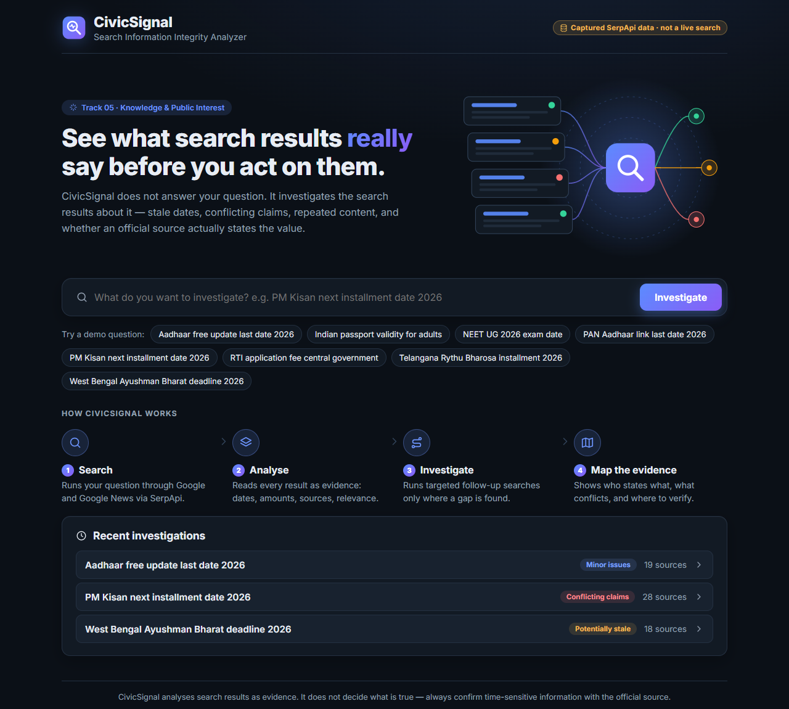
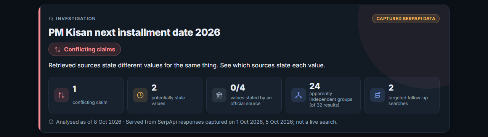
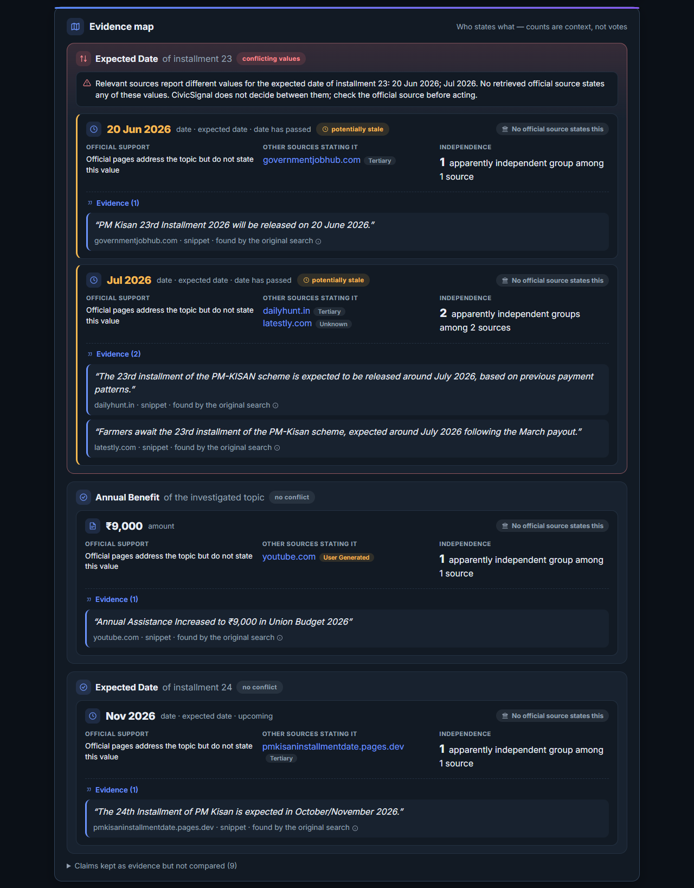
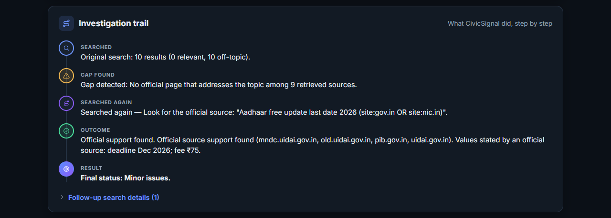

# CivicSignal — Search Information Integrity Analyzer

> **CivicSignal does not answer your question. It investigates the search results about it.**

People in India look up deadlines, fees and installment dates for public schemes — Aadhaar updates, PAN–Aadhaar linking, PM Kisan installments — and act on the first results they see. Those results are often **out of date, contradict each other, copy each other, or never cite an official source**.

CivicSignal takes a question, searches with **SerpApi**, treats every result as evidence, and shows:

- which **dates have already passed** but are still presented as current or upcoming,
- where sources **state conflicting values** for the same thing,
- which results **repeat the same content** (so 10 results may be only 3 independent sources),
- whether an **official source actually states** a value — not just whether an official page exists,
- when the first search has a **gap**, what **targeted follow-up searches** it ran and what they found.

Every finding links back to the exact result text it is based on. CivicSignal never says a claim is "true" or "false" — it shows the evidence and where to verify it.

Built for the **SerpApi India Hackathon 2026 — Track 05: Knowledge & Public Interest**.



---

## What a report looks like

**Summary** — status, explanation and the key numbers at a glance:



**Evidence map** — every extracted value, who states it, whether an official source states it, how independent the sources are, and the exact quote:



**Investigation trail** — why CivicSignal searched again and what it found. Here the original search for Aadhaar returned 10 off-topic results; a targeted official-source search recovered pages from UIDAI and PIB that state the deadline and fee:



---

## How SerpApi is used

SerpApi is the data layer of the whole system — every piece of evidence comes from it.

| Step | SerpApi call | Why |
|---|---|---|
| Original search | `engine=google`, `gl=in`, `hl=en` | The landscape a user actually sees: organic results, top stories, answer box, "People also ask" |
| Official-source lookup | `engine=google` with `site:gov.in OR site:nic.in` (or a specific official domain mentioned in the results) | Find out whether an official page states the disputed value |
| Recency check | `engine=google` with `tbs=qdr:m` (past month) | Look for newer information when dates appear stale |
| News check | `engine=google_news` | See whether an expected event has since been reported |

Follow-up searches are **planned from the evidence**, not run blindly: a follow-up only happens when the first search shows a specific gap (conflict without official support, stale dates, no relevant official page). Each investigation uses at most **3 searches** (1 original + up to 2 follow-ups), and responses are cached to avoid repeat spend.

---

## Quick start

Requirements: **Python 3.11+** (tested on 3.13) and **Node.js 18+** (developed on 24).

### 1. Backend

```bash
git clone https://github.com/srividyatatikondala/civicsignal.git
cd civicsignal
python -m venv .venv

# Windows
.venv\Scripts\activate
# macOS / Linux
source .venv/bin/activate

pip install -r requirements.txt
```

> On Windows, clone into a short folder (e.g. `C:\dev\civicsignal`) or run `git config --global core.longpaths true` first — Windows limits file paths to 260 characters.

**Demo mode (no API key needed)** — replays real SerpApi responses captured on 1 and 5 October 2026 for the 8 demo questions:

```bash
cd backend

# Windows PowerShell
$env:MOCK_SERPAPI = "true"
# Windows cmd
set MOCK_SERPAPI=true
# macOS / Linux
export MOCK_SERPAPI=true

python -m uvicorn civicsignal.api.app:create_app --factory --port 8000
```

**Live mode** — searches any question through SerpApi in real time. Copy `.env.example` to `.env` in the project root, set `SERPAPI_API_KEY=your_key` and `MOCK_SERPAPI=false`, then start the same command. Each investigation uses 1–3 SerpApi searches.

> Never commit `.env` — it is in `.gitignore`. The API key is only read on the server and is never sent to the browser.

### 2. Frontend

In a second terminal:

```bash
cd frontend
npm install
npm run dev
```

Open **http://localhost:5173** and click one of the demo questions. The badge in the top-right shows whether you are on captured data or live SerpApi.

API docs are at **http://localhost:8000/docs**.

### 3. Tests

```bash
python -m pytest
```

465 tests run fully offline against the captured SerpApi responses (no key, no network). Three tests are marked as expected failures — they document known limitations (see [docs/evaluation.md](docs/evaluation.md)).

---

## Demo questions (captured data)

| Question | Result | What it shows |
|---|---|---|
| PM Kisan next installment date 2026 | Conflicting claims | Sources disagree on the 23rd installment date (20 Jun vs Jul 2026); official pages found by a follow-up do not state either date |
| PAN Aadhaar link last date 2026 | Conflicting claims | Old deadlines (2019, 2025) still ranking; a past-month search adds newer coverage |
| Aadhaar free update last date 2026 | Minor issues | Original search was entirely off-topic; a targeted official search recovered UIDAI/PIB pages stating the deadline (Dec 2026) and fee (₹75) |
| West Bengal Ayushman Bharat deadline 2026 | Potentially stale | A 2024 deadline still presented in results; official lookup returned no results |
| Telangana Rythu Bharosa installment 2026 | Potentially stale | Official pages exist but none address the question |
| NEET UG 2026 exam date | Minor issues | Some off-topic results; few primary sources |
| RTI application fee central government | No issues detected | Two independent sources agree on ₹10 |
| Indian passport validity for adults | No issues detected | Clean control |

"No issues detected" means the checks found nothing — it is **not** a verification of the information.

---

## Architecture (short)

```
React + Vite UI  ──/api──►  FastAPI
                              │
                              ▼
                   Investigator (orchestrator)
     SerpApi client ─► normalise ─► extract claims ─► detectors ─► planner ─► follow-up searches
     (cache, retry,     (results,     (dates, amounts,   staleness       (reason-coded,   (re-analysed
      mock fixtures)     sources,      subjects, roles)   contradiction   budgeted)        with the rest)
                         evidence                         duplication
                         spans)                           authority
                                                          relevance
                              │
                              ▼
                 SQLite store ─► Evidence-map report ─► UI
```

Fully deterministic and rule-based — **no LLM is required**. An optional, provider-agnostic LLM interface exists but is off by default.

More detail:
- [docs/architecture.md](docs/architecture.md) — components, data model, API
- [docs/methodology.md](docs/methodology.md) — how each check works and what it deliberately does not do
- [docs/evaluation.md](docs/evaluation.md) — measured results on the captured data, and known limitations

---

## Principles

- **Evidence first.** Every finding points to the exact result text (title or snippet) it was read from.
- **No verdicts.** CivicSignal reports "potentially stale", "conflicting claims", "official source states this value" — never "true", "false" or "fake".
- **Counts are not votes.** Ten results repeating a value may be one syndicated article; the value most sources repeat is not treated as correct.
- **Official ≠ proof.** An official page can be outdated too; CivicSignal distinguishes an official page *existing*, *addressing the topic*, and *stating the specific value*.
- **Honest about its data.** Captured responses are always labelled with their capture date and "not a live search".

## Project layout

```
backend/
  civicsignal/          FastAPI app, orchestrator, planner, report builder
    serp/               SerpApi client, cache, fixtures, parsing
    normalize/          results → sources → evidence spans
    claims/             date & amount extraction, subjects, clustering, eligibility
    detectors/          staleness, contradiction, duplication, authority, relevance
    models/             Pydantic models (investigation, evidence, report)
    db/                 SQLite persistence
  fixtures/serpapi/     17 captured SerpApi responses (demo mode + tests)
  tests/                465 offline tests
frontend/               React 18 + Vite 5 dashboard
docs/                   architecture, methodology, evaluation, screenshots
```

## License

[MIT](LICENSE)
